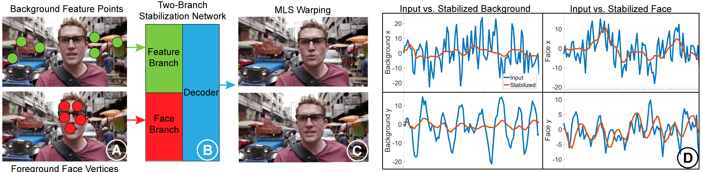

# Real-Time Selfie Video Stabilization

This is the code for the paper "[Real-Time Selfie Video Stabilization](https://cseweb.ucsd.edu//~ravir/jiyangcvpr21.pdf "Real-Time Selfie Video Stabilization")", CVPR 2021



Note 1: We are still working on building this repository, uploading training data and cleaning up training code. Please stay tuned for more updates.
Note 2: To use this code, you need to compile opencv-python from source with cuda and python support. 

Quick Start:

1. Download pretrained weights at [pretrained weights](https://drive.google.com/file/d/1h8Dv861koK4f-kpf01kao61kOgaFaOTZ/view?usp=sharing "pretrained weights")
2. Unzip the pretrained weights package. There are 5 files listed below:
 - 1.avi : an example video for demo
 - checkpt_fcn.pt : pretrained weight for the foreground/background segmentation
 - checkpt_stabnet.pt : pretrained weight for the selfie video stabilization network
 - default_face.npy : a default neutral pose 3D face in case no face is found in the frame
 - shape_predictor_68_face_landmarks.dat : used by the face landmark detector
3. Put "1.avi" under './example'
4. Put "checkpt_fcn.pt", "checkpt_stabnet.pt" and "default_face.npy" under './'
5. Put "shape_predictor_68_face_landmarks.dat" under "./landmark_detection"
6. Run "main.py", the stabilized result can be found in './result'

The 26 example selfie videos can be downloaded at [example videos](https://drive.google.com/file/d/1Vft8LML8ZpO0fKjG-cU6-ruTHOjOw0zw/view?usp=sharing "example videos")

## Dataset 
The authors are still working on making the dataset fully public, due to the difficulty of uploading the oversized detected feature points and face vertices. While we are resovling the issues, we first make the raw videos and detected masks available at [Selfie_Video_Dataset](https://mega.nz/folder/ftVmSTQS#iWV1Kunz0FGLA4b51A7Q0g). We will update the follow-up data to this folder. Please stay tuned for more data and training code.

## Reference 
If you find our work useful, please cite our paper:
````
@InProceedings{Selfie21,
  author       = "Jiyang Yu and Ravi Ramamoorthi and Keli Cheng and Michel Sarkis and Ning Bi",
  title        = "Real-Time Selfie Video Stabilization",
  booktitle    = "IEEE Conference on Computer Vision and Pattern Recognition (CVPR)",
  month        = "Jun",
  year         = "2021"
}
````
